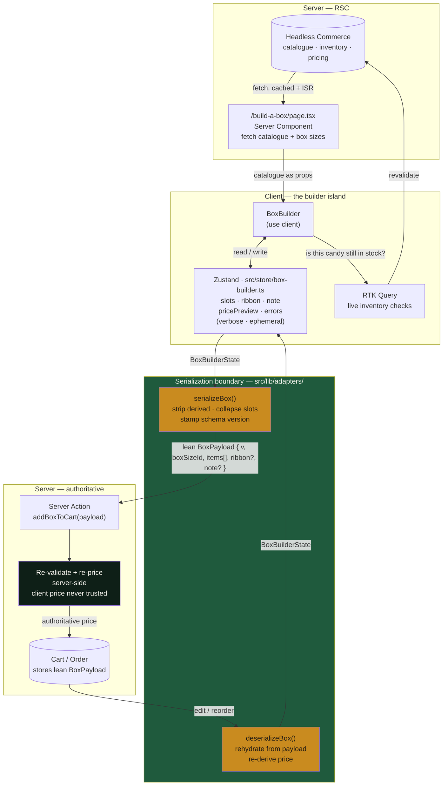
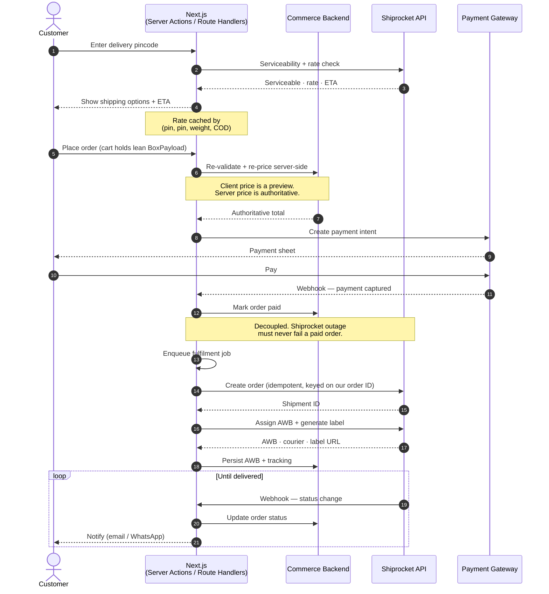
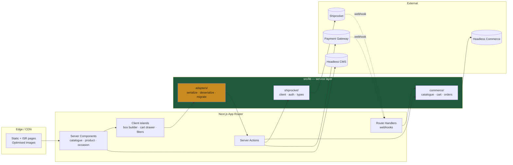

# Architecture — Al-Hala Candies

How the system is put together, why, and where the seams are.

---

## 1. Headless Next.js

The storefront is a **Next.js App Router** application. It owns presentation, routing,
SEO, and the Build-a-Box experience. It owns no commerce primitives.

Everything else lives behind an API:

| Concern                       | Owner                       |
| ----------------------------- | --------------------------- |
| Catalogue, inventory, pricing | Headless commerce backend   |
| Editorial content, occasions  | Headless CMS                |
| Orders, payments              | Commerce backend + PSP      |
| Shipping, rates, tracking     | **Shiprocket**              |
| Presentation, SEO, box builder| **This Next.js app**        |

### Why headless

- The gifting experience — occasion pages, the box builder, gift notes, scheduled
  delivery — is bespoke. No hosted-storefront theme survives contact with it.
- SEO and Core Web Vitals are business-critical for a gifting brand. RSC + streaming +
  a disciplined image pipeline gives us control a hosted theme cannot.
- The commerce backend can be replaced without rewriting the storefront, provided every
  call goes through the service layer below.

### Rendering strategy

| Route                        | Strategy                                       |
| ---------------------------- | ---------------------------------------------- |
| Home, occasion landing pages | Static, ISR — content changes rarely, SEO matters most |
| Category / listing           | Static + ISR; filters resolve client-side over a server-rendered set |
| Product detail               | Static + ISR, revalidated on catalogue webhook  |
| Build-a-Box                  | Server shell (catalogue, box sizes) + client island (the builder) |
| Cart, checkout, account      | Dynamic, always fresh, never cached             |

`src/lib/` holds a thin service layer per backend. **No feature component ever calls a
vendor SDK or a raw `fetch` to a vendor URL directly.** Swapping a backend should be a
change inside `src/lib/`, not a change across `src/app/`.

---

## 2. Build a Box — state strategy

The box builder is the only genuinely complex client state in the app. It is also the
place most likely to rot, so the rules are explicit.

### The core principle

> **Rich state lives in the client. Lean payloads go to the server.**
> Never persist the working UI state.

The builder's in-memory state is deliberately verbose — it holds derived values,
denormalised product data, drag-and-drop slot positions, validation errors, and a live
price preview, all so the UI feels instant. **None of that belongs in the database.**

### Three layers

**Layer 1 — Server data (RSC / RTK Query).**
The candy catalogue, box sizes, and pricing rules are fetched on the server and passed
into the builder as props. Where the client genuinely needs cached, revalidating server
data (live inventory checks while the user fills slots), **RTK Query** owns it.
Server data is *never* mirrored into Zustand.

**Layer 2 — Builder UI state (Zustand, `src/store/`).**
Ephemeral, client-only, verbose:

```ts
// src/types/box.ts — implemented
interface BoxBuilderState {
  currentStep: BuilderStep        // 1 Choose · 2 Select · 3 Personalize · 4 Review
  selectedBox: BoxType | null     // full object: name, capacity, price, image
  candies: CandyLine[]            // full CandyItem per line + qty
  personalNote: string
}
```

**Derived values are not in the state.** No `pricePreview`, no `slotsFilled`, no
`errors` — a stored derived value is one that goes stale the moment something forgets to
recompute it. They are computed in selectors (`useBoxProgress`, `useBoxTotal`) instead.

**Layer 3 — Serialised payload (`src/lib/adapters/`).**
Before anything crosses the network — add-to-cart, save-for-later, checkout — it passes
through the adapter and becomes lean and versioned:

```ts
// src/types/box.ts — what the cart and database actually store
interface BoxPayload {
  schemaVersion: number                          // BOX_SCHEMA_VERSION, currently 1
  boxSku: string
  candySkus: Array<{ sku: string; qty: number }> // SKUs and counts. nothing else.
  note?: string
}
```

Note what is **gone**: `currentStep`, every embedded product object, and every candy
name, image URL, and price. Those are UI concerns and catalogue facts. Persisting them
means a saved box carries a stale copy of a price the moment the catalogue changes.
A unit test asserts the serialized payload contains none of them.

### The Serialization Adapter pattern

`src/lib/adapters/box-adapter.ts` owns the boundary in both directions:

| Function                                             | Responsibility                                                    |
| ---------------------------------------------------- | ----------------------------------------------------------------- |
| `serializeBox(state) → BoxPayload`                   | Strip derived + UI-only fields and every catalogue fact. Stamp `schemaVersion`. **Throws** on over-capacity or no-box — an invalid box in the cart costs far more to unpick than a failed add-to-cart. |
| `deserializeBox(payload, catalogue) → DeserializedBox` | Rehydrate for edit / reorder. Returns `{ state, missingSkus, droppedSkus }` — a discontinued candy or a shrunk box must be *reported*, not silently swallowed, and the trimmed result must still be saveable. |
| `migratePayload(payload) → BoxPayload`               | **Not yet built.** `deserializeBox` currently throws `BoxSchemaVersionError` on a version mismatch. Needed before the payload shape changes for the first time. |

Rules:

- Adapters are **pure functions**. No fetching, no store access, no side effects.
- They are the most test-worthy code in the repo. Unit test them first.
- The payload is **versioned from day one**. A box saved today must still open in a
  year, after the catalogue has changed underneath it.
- **Money is integer minor units end to end.** Never a float. Format only at the render edge.
- **The client price is a preview and is never trusted.** The server recomputes the
  authoritative price from `BoxPayload` + current pricing rules at checkout. A mismatch
  is surfaced to the user, never silently accepted.

### Data flow — Build a Box



---

## 3. Checkout & fulfilment — Shiprocket

**Shiprocket** is the shipping and fulfilment layer: serviceability checks, rate
quotes, order push, AWB assignment, label generation, and tracking.

### Integration rules

- **Server-side only.** Shiprocket credentials never reach the browser. All calls
  originate from Route Handlers or Server Actions.
- **One client, one place.** `src/lib/shiprocket/` owns the API client, auth, types, and
  error mapping. Nothing outside that folder imports it.
- **Token lifecycle.** Shiprocket issues a bearer token with a finite lifetime. The
  client caches it server-side and refreshes on expiry or on a `401`. Do not
  re-authenticate on every call.
- **Rate quotes are cached and treated as estimates.** Cache by
  `(pickup pin, delivery pin, weight bucket, COD flag)`. The rate shown at checkout is
  reconciled against the rate at order push; a divergence is logged, not silently absorbed.
- **Serviceability is checked before the customer commits.** A pincode that cannot be
  served must fail at the address step, not after payment.
- **Order push is idempotent.** Keyed on our order ID. Shiprocket returning a duplicate
  is a success, not an error. A network timeout must never create two shipments.
- **Push is asynchronous and retried.** Payment success and Shiprocket push are
  decoupled — a Shiprocket outage must not fail a paid order. Push to a queue, retry
  with backoff, alert on exhaustion.
- **Tracking is webhook-driven.** Shiprocket posts status changes to a Route Handler.
  Verify the payload, update order state, trigger customer notification. Never poll.
- **Gift shipments carry gift semantics.** No price on the packing slip when the order
  is flagged as a gift. This is a hard requirement of the product, not a nice-to-have.

### Data flow — checkout to doorstep



---

## 4. System map



**The load-bearing constraint:** everything crossing a network boundary goes through
`src/lib/`. Feature components never touch a vendor SDK. That is what makes the
"headless" claim real rather than decorative.

---

## 5. Open decisions

These are unresolved and block Phase 1. They are listed here rather than assumed.

| # | Decision                        | Why it matters                                                        |
| - | ------------------------------- | --------------------------------------------------------------------- |
| 1 | **Headless commerce backend**   | Shapes the cart/order model and whether `BoxPayload` fits a native line-item shape or needs a custom-attribute escape hatch. |
| 2 | **CMS**                         | Occasion pages and gifting guides are the primary SEO surface. Needs a real editorial model, not hardcoded MDX. |
| 3 | **Payment gateway**             | Region and method mix (cards, UPI, COD). COD interacts directly with Shiprocket rate logic. |
| 4 | **Does COD ship?**              | If yes, it touches serviceability, rates, and reconciliation. Not a checkbox. |
| ~~5~~ | ~~**Locales — is Arabic a shipping locale?**~~ | ✅ **Decided: yes.** Logical properties are mandatory from the first component (`CLAUDE.md` §1b). `next-intl` + per-locale `dir` still to be wired. |
| 6 | **Inventory model for the box builder** | Reserve-on-add vs check-at-checkout. Affects whether RTK Query live checks are advisory or binding. |

Nothing in Phase 1 should be built on a guess at any of the above.
